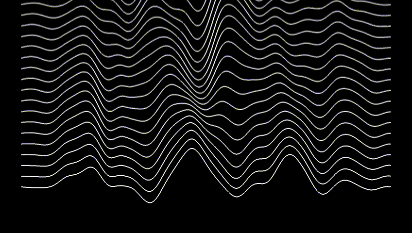

# Simplex Noise Loop

In this repository you'll find a few examples on how to create a Simplex Noise Loop with the `[jit.bfg]` object within Max Jitter. The patches further demonstrate how these noise loops can be applied on various geometry such as a line, circle, plane and particle coordinates generated with the `[jit.gl.mesh]` object. Furthermore the patches demonstrate how these noise-loops can be captured with `[jit.record]` to a `.gif` file format, how you can set resolution, fps, loop-length, noisiness, noise-scale and more parameters. Some patches also include some post-processing on the captured texture of the mesh with `[jit.gl.node]` through `[jit.gl.pix]`.

# Line Noise Loop



# Circle Noise Loop


# Plane Noise Loop


# Particles Noise Loop


# Usage

Download zip
```
1. download zip
2. unzip
```
Git clone
```
1. $ cd ~/Documents/Max\ 8/Library
2. $ git clone https://github.com/tmhglnd/simplex-noise-loop.git
```

```
3. Open any of the patches
4. Follow the numbers
```

# License

The MIT License
